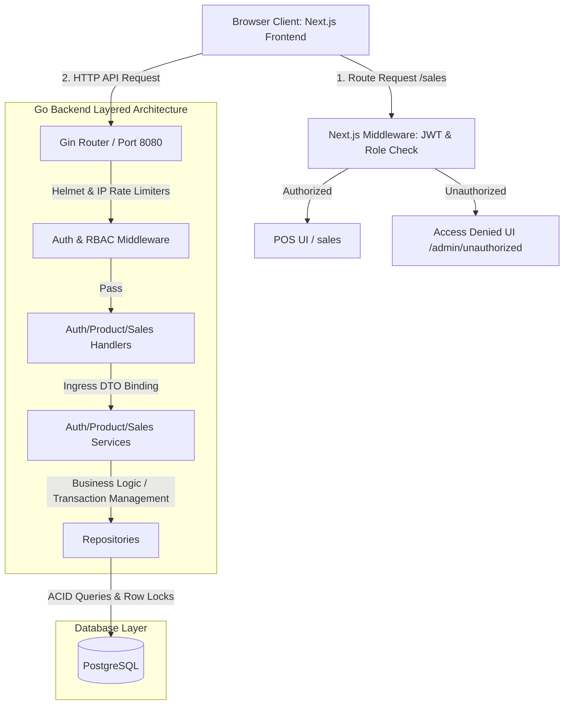
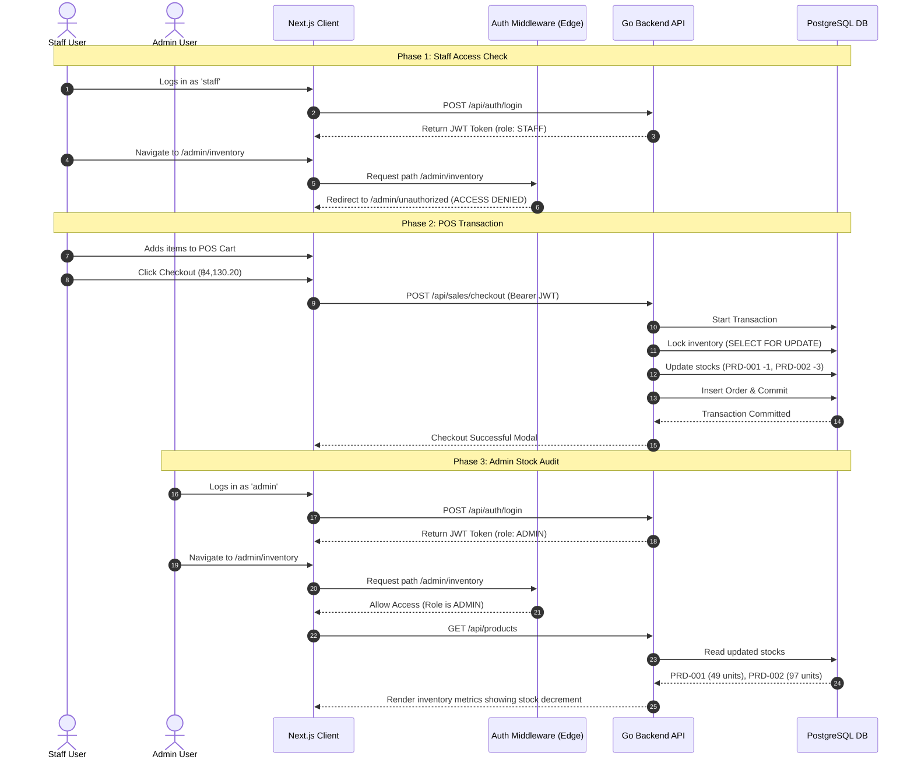
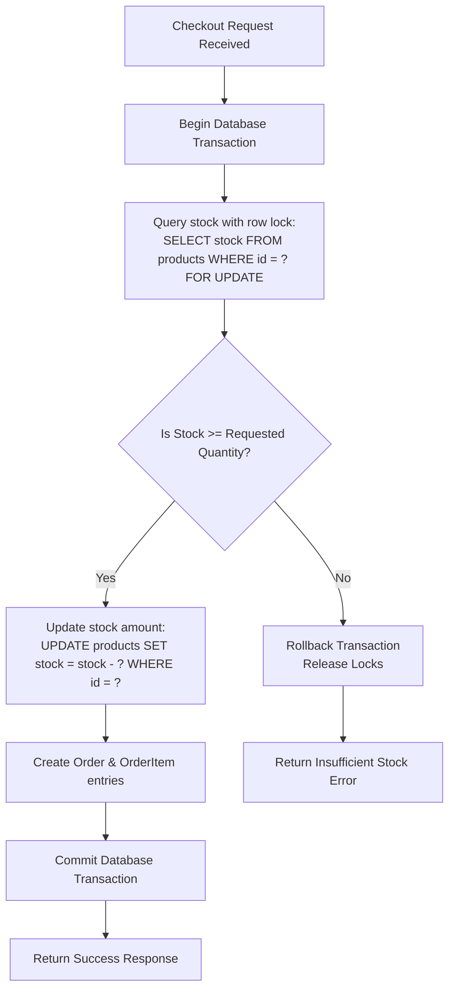
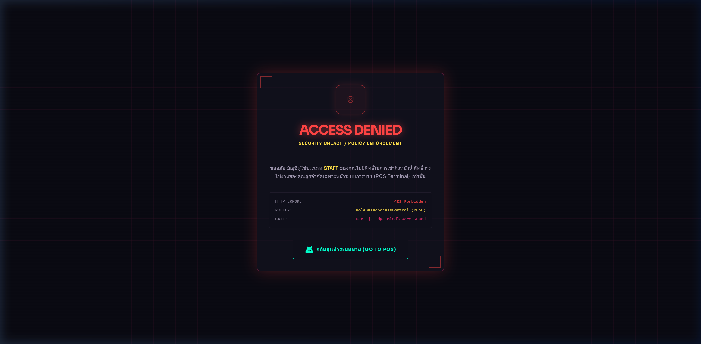
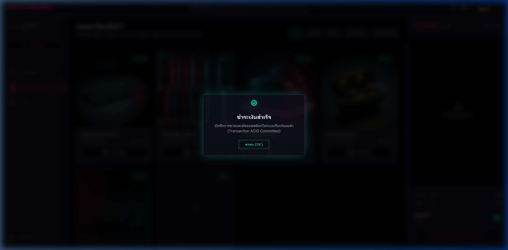
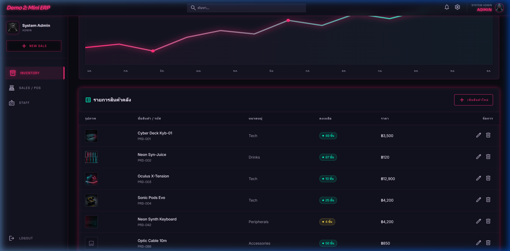

# Enterprise Mini ERP Demo (Go + Next.js + Docker Compose)

Welcome to the **Enterprise Mini ERP Demo**. This project is engineered as a production-ready, highly secure, and optimized micro-ERP system designed for fluid presentations. 

It implements a high-performance **Go (Golang)** REST API, a retro-futuristic **Next.js App Router** frontend styling, and a **PostgreSQL** relational database. Everything runs out of the box in isolated containers.

---

## 🛠️ Technology Stack & Architecture

```
                                      +------------------------------------+
                                      |          Docker Network            |
                                      |                                    |
+--------------------+   Port 3000    |  +--------------+  API (Port 8080) |
|   Client Browser   | <------------> |  | Next.js App  | -------------\   |
| (Neon Tokyo Theme) |                |  |  (Frontend)  |              |   |
+--------------------+                |  +--------------+              v   |
          ^                           |                        +------------+
          |                           |                        | Go API App |
          +-------------------------> |                        | (Backend)  |
                     Port 8080        |                        +------------+
                   (Public APIs)      |                              |     |
                                      |            GORM DB queries   |     |
                                      |            & Transactions    v     |
                                      |                        +------------+
                                      |                        | PostgreSQL |
                                      |                        | (Database) |
                                      |                        +------------+
                                      +------------------------------------+
```

### 🧩 Logical Architecture & Security Boundary Routing



### 1. Backend (Go Module `/backend`)
* **Layered Clean Architecture (N-Tier):** Separate concerns via Handlers (Controllers) -> Services (Business Logic) -> Repositories (Database mapping).
* **REST Routing:** Built on **Gin-Gonic** for maximum throughput.
* **Database & Transactions:** Powered by **GORM** interfacing PostgreSQL. Uses interactive transactions and row-level locking (`SELECT ... FOR UPDATE`) to prevent inventory race conditions.
* **Security (OWASP Top 10):**
  * Parameterized SQL queries via ORM to block SQL Injections.
  * Secure Cookie & JWT-based authentication.
  * Role-Based Access Control (RBAC) middleware verifying roles.
  * Helmet security headers configuration.
  * Dynamically throttled API endpoints via an IP Rate Limiter.

### 2. Frontend (React Next.js `/frontend`)
* **Framework:** Next.js App Router (using React Server Components for optimal load speeds).
* **Styling & Theme:** **Tailwind CSS v4** styling with custom Tokyo Neon preset (Glassmorphism, scanlines, moving parallax horizon, and cursor-following neon trail).
* **Navigation Security:** Next.js Edge Middleware intercepting routing requests server-side, protecting `/admin/*` paths.

---

## 🚀 Setup & Launch Instructions

You only need **Docker** and **Docker Compose** installed on your machine.

1. **Launch Containers:**
   In the project root directory, run:
   ```bash
   docker compose up --build -d
   ```

2. **Verify Services Status:**
   * Frontend Client: `http://localhost:3000`
   * Backend REST API: `http://localhost:8080`
   * Backend Health Endpoint: `http://localhost:8080/health`

3. **Database Seeding:**
   The database automatically creates schemas and seeds accounts/products on startup:
   * **Admin Account:** Username `admin` | Password `admin123`
   * **Staff Account:** Username `staff` | Password `staff123`

---

## 🎬 Demo Storyboard Presenter Script

When presenting this ERP demonstration to clients or stakeholders, follow this structured story to show off the system's architecture:

### Step 1: RBAC Routing Enforcement (Broken Access Control Prevention)
1. Navigate to the login page at `http://localhost:3000/login`.
2. Login with the **Staff** account:
   * **Username:** `staff`
   * **Password:** `staff123`
3. Once logged in, try clicking the **Inventory** or **Staff** options in the Side Navigation.
4. **Result:** Next.js Middleware blocks the request immediately, routing the browser to a customized Cyberpunk **"Access Denied (403 Forbidden)"** warning page. Explain how this enforces server-side route security, keeping staff out of administrative operations.

### Step 2: POS Catalog & Basket Checkout
1. Go back to the **Sales** POS screen (`/sales`).
2. Add **1x Cyber Deck Kyb-01** (฿3,500) and **3x Neon Syn-Juice** (฿120) to the cart.
3. Click the **ชำระเงิน (Checkout)** button.
4. **Result:** The system triggers a checkout API request. The transaction is validated, committed, and a success dialog appears.

### Step 3: ACID Transactions & Concurrency Demo (Backend Code Integrity)
1. Log out by clicking **Logout** in the bottom-left corner.
2. Log in using the **Admin** account:
   * **Username:** `admin`
   * **Password:** `admin123`
3. You will be redirected to the **Inventory Control Room** (`/admin/inventory`).
4. **Result:** Point out that:
   * **Cyber Deck Kyb-01** stock has decremented from **50** to **49**.
   * **Neon Syn-Juice** stock has decremented from **100** to **97**.
5. Explain how the Go backend uses `SELECT ... FOR UPDATE` within a GORM interactive transaction. If two cashiers checkout the last remaining item at the exact same millisecond, the database serializes the locks, ensuring the second cashier receives an "Insufficient Stock" rollback error and preventing inventory corruption.

---

## 📊 System Sequence & Logic Flowcharts

These sequence diagrams and process flowcharts illustrate the logical interactions and transactions designed into the system:

### 1. Storyboard E2E Sequence Flow (Staff Check & Admin Stock Audit)
This diagram maps out the multi-phase browser validation tested using automated E2E test runs:



### 2. ACID Row-Level Lock Stock Decrement Flow (Concurrency & Race Condition Prevention)
This flowchart shows how the database interactive transaction manages product catalog operations concurrently:



---

## 📸 System Interface & E2E Storyboard Flow

Here are the system previews captured during automated E2E testing:

#### 1. Unauthorized Access Guard (RBAC Prevention)
If a user with the `STAFF` role attempts to bypass navigation and access `/admin/inventory`, the Next.js edge middleware intercepts the request and redirects them to this Cyberpunk-themed **Access Denied** alert page.



#### 2. POS Catalog & ACID Checkout Modal
Cashiers and sales staff can add items, dynamically calculate totals (Subtotal, 7% Tax, Grand Total), and checkout. The backend commits an isolated, thread-safe database transaction to audit inventory.



#### 3. Real-Time Admin Inventory Room (Stock Audit)
Once checked out, administrators logging in are greeted with the Neon Tokyo Control Room displaying real-time metrics, monthly performance SVG graphics, and precise stock decrements.


